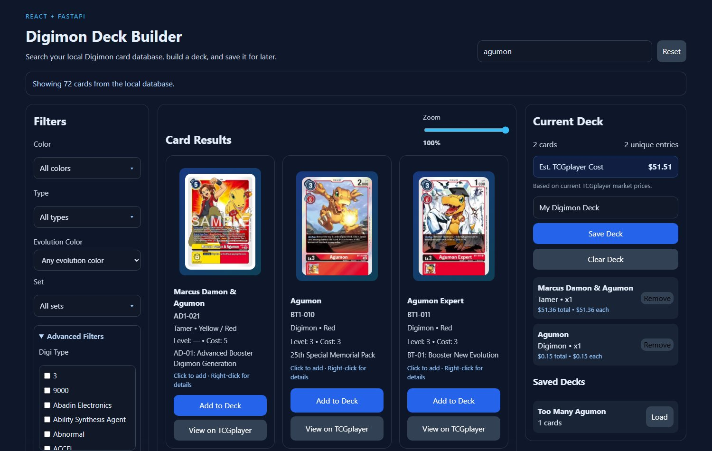
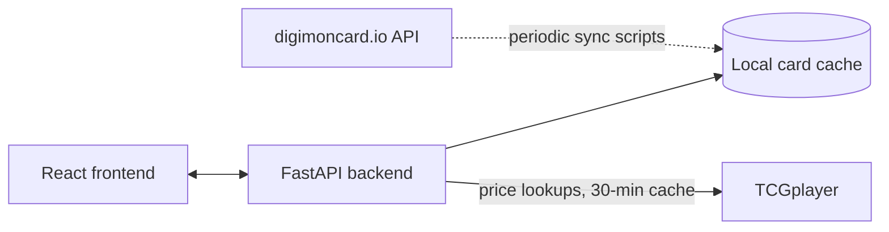
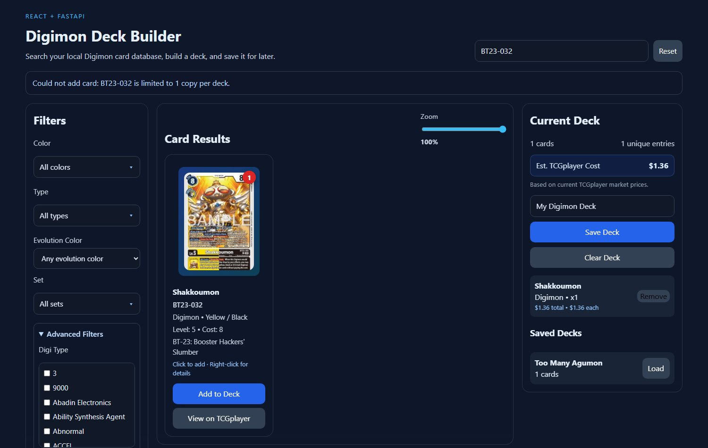

# Digimon Deck Builder

A full-stack deck builder for the Digimon TCG: search a local card database, build a deck while real construction rules are enforced live, and see an estimated real-money cost pulled from current TCGplayer prices.

**4,207 cards indexed · 38 automated tests · CI (backend + frontend)**



*Screenshotted from a running instance — the deck shown has real cards priced from live TCGplayer data ($51.51 estimated total), not mocked numbers.*

Not a card scanner — decks are built by searching/filtering the local card database, not by scanning physical cards.

## Problem

Building a legal, priced Digimon TCG deck by hand means juggling three separate things: a card database to search, a banlist to cross-check, and a marketplace to price the deck out on. This project puts all three in one page — search/filter a local card database, get real-time feedback on copy limits and banned cards/pairs as you build, and see the deck's live estimated cost without leaving the page.

## Architecture



The card database is local-first by design: the frontend and API routes never call `digimoncard.io` directly on the request path — they read from a JSON cache built ahead of time by the sync scripts (see [Implementation](#implementation)). `digimoncard.io`'s API has real rate limits (`REQUEST_DELAY` in `config.py`), so keeping it entirely off the request path means searches and filters stay fast regardless of that API's availability. TCGplayer pricing is the one live external call, and it's scoped to just the cards actually in the current deck, with a 30-minute cache per card.

CORS is scoped to the specific Vite dev origins (`localhost:5173`/`5174`), not a wildcard — worth naming since it's an easy thing to get wrong in a local full-stack dev setup.

## Getting Started

### Backend

```bash
cd deck-builder-app/backend
pip install -r requirements.txt
uvicorn main:app --reload
```

- `http://127.0.0.1:8000/docs` — interactive API docs
- `http://127.0.0.1:8000/api/health` — health check

### Frontend

```bash
cd deck-builder-app/frontend
npm install
npm run dev
```

- `http://127.0.0.1:5173/` (Vite will pick `5174` if `5173` is taken)

### Checks

```bash
# backend
python -m ruff check . && python -m ruff format --check . && python -m mypy app main.py && python -m pytest -q
# frontend
npm run lint && npm run build
```

Same checks CI runs on every push.

### One-command startup

```bash
cd deck-builder-app/script
chmod +x start_app.sh
./start_app.sh
```

## Implementation

### Deck construction rules

`app/deck.py` enforces real Digimon TCG deck-construction rules against `data/restricted_list.json`, not just a hardcoded max: a 4-copy default limit, per-card limits for restricted cards (some cards are capped at 1 or 2), fully banned cards, and banned pairs (cards that can't appear in the same deck together). Validation runs both when adding a single card and when saving/loading a whole deck, so a saved deck can't silently violate a rule that was added after it was created.



*Shakkoumon (BT23-032) is limited to 1 copy per the restricted list — adding a second copy is rejected with the actual backend error message, not a silently emptied deck (see [Engineering Decisions](#engineering-decisions)).*

### Backend

| File | Responsibility |
|---|---|
| `main.py` | FastAPI app setup, CORS, mounts `/images`, includes the API router |
| `app/api.py` | Card search/filter routes, deck routes, card normalization |
| `app/deck.py` | Deck rule validation, `DeckManager` (saved decks), `CurrentDeckStore` (active deck), TCGplayer price fetching/caching |
| `app/storage.py` | Card cache loading/saving, dedup, staleness checks |
| `config.py` | Paths and constants (`CARD_FILE`, `BASE_URL`, `REQUEST_DELAY`, etc.) |

API routes:

**Cards** — `GET /api/cards`, `GET /api/cards/search` (filters: `q`, `color`, `card_type`, `pack`, `limit`), `GET /api/cards/local`, `GET /api/cards/{card_id}`
**Current deck** — `GET /api/deck`, `POST /api/deck/add`, `POST /api/deck/remove`, `POST /api/deck/clear`, `POST /api/deck/load`
**Saved decks** — `GET /api/decks`, `GET /api/decks/{deck_name}`, `POST /api/decks`

```bash
curl "http://127.0.0.1:8000/api/cards/search?q=agumon&color=red&limit=5"
```

### Sync scripts

- **`scripts/update_cards.py`** — fetches from the Digimon API, skips already-complete saved cards, refreshes incomplete ones, dedupes by card ID, writes `data/cards/all_cards.json`. Retries transient failures per-card, and one failed card doesn't abort the whole run.
- **`scripts/sortall_cards.py`** — sorts the card database into `data/cards/by_set/<SET>/` folders.
- **`scripts/download_card_images.py`** — downloads card images into `data/images/`, served at `/images/<CARD_ID>.webp`.

### Frontend

React + Vite, talking to the backend through `/api` and `/images`. `App.jsx` owns all top-level state (filters, cards, current deck, saved decks) via hooks — no Redux/Context, which is proportionate at this size. Components: `SearchBar`, `FilterPanel`, `CardGrid`, `CardItem`, `DeckPanel`.

## Testing

```bash
cd deck-builder-app/backend
python -m pytest -q
```

38 tests covering card search/filtering, deck CRUD and validation (copy limits, banned cards, banned pairs), and the TCGplayer pricing engine directly — caching behavior, printing-type preference, the dual-endpoint fallback, and network-failure handling, all against a faked `requests.get` rather than the real API.

The frontend has no test framework yet (see [Known Limitations](#known-limitations)); CI instead runs ESLint and a production build on every push, which catches broken imports/syntax — the same class of issue a missing test suite would otherwise miss.

## Results

- **4,207 cards** in the local database, kept in sync via the update script rather than fetched live per request
- **38 backend tests**, all passing in CI, including direct coverage of the pricing engine (added after an audit found it was previously only ever exercised through a mocked stand-in)
- **CORS scoped to specific origins**, not `*` — verified by reading `main.py`, not assumed
- Backend is fully type-annotated and passes `mypy` cleanly; both backend (`ruff`) and frontend (`eslint`) are lint-clean

## Engineering Decisions

**Fixing a silent deck-corruption bug, verified live, not just read.** An audit of this repo found that `App.jsx`'s deck-mutating functions never checked `response.ok` — a validation failure (e.g. adding a banned card) returned a `400` with a real error message, but the frontend parsed that error body as if it were a successful deck payload, silently emptying the visible deck with no indication anything went wrong. Rather than just patching it from reading the code, I installed Node, ran both the real backend and the real Vite dev server, and reproduced the exact broken scenario through the actual UI before and after the fix — confirmed the status banner now shows the real error and the deck no longer corrupts.

**mypy here, not on Manga Library.** This backend was already fully type-annotated end to end; adding `mypy` surfaced exactly one real issue (a missing variable annotation) in the entire codebase. Manga Library's data-access layer, by contrast, has zero type annotations, and making `mypy` pass there would mean typing 13 functions from scratch — a real design decision, not a quick pass. Same tool, different codebases, different amount of the underlying prerequisite already in place — so one got it added and the other didn't, rather than applying the same checklist everywhere regardless of fit.

**Local-first card data instead of live API calls.** `digimoncard.io`'s API is rate-limited (`REQUEST_DELAY`), so search/filter routes read from a local JSON cache built by a separate sync script rather than proxying live requests — the app stays fast and available even if that API is slow or down, at the cost of the local cache going stale until the next sync.

## Known Limitations

- **No frontend test framework.** ESLint and a production build run in CI, but there's no Vitest/React Testing Library coverage yet — UI regressions like the one fixed in this audit wouldn't be caught automatically today.
- **TCGplayer pricing depends on undocumented endpoints.** `get_card_market_price()` calls `mpapi.tcgplayer.com` and `mp-search-api.tcgplayer.com`, which aren't TCGplayer's public documented API (that requires OAuth app approval) — they look like the internal endpoints TCGplayer's own site uses, and could change or break without notice.
- **`CurrentDeckStore` is a single in-memory instance**, not per-session — fine for personal/local use (the same design Manga Library uses for its own state), but it resets on server restart and isn't safe for multiple concurrent users.
- **No auth** — appropriate for a personal local tool, not for anything public-facing.
